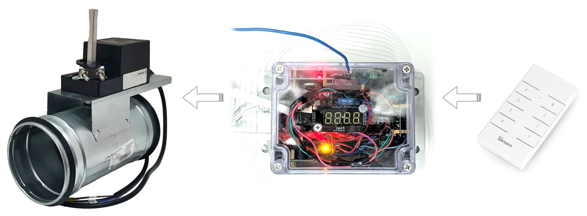
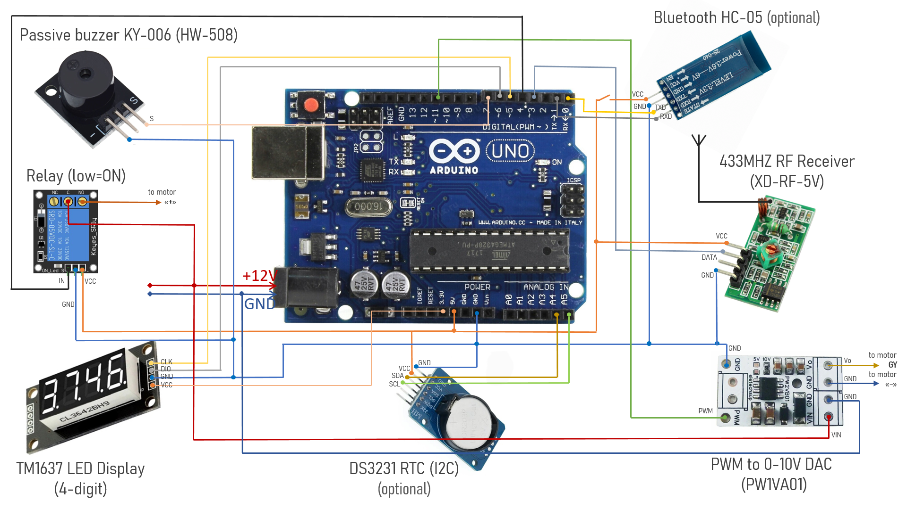

# Ventilation Damper Controller

An Arduino-based controller for a ventilation damper.
Provides remote control of the ventilation tube throttle using a 433MHz RC and/or a Bluetooth/COM text interface.

## Hardware

* Air throttle valve for supply and exhaust ventilation systems (100/120mm diameter)
* Electric motor for air damper 2-4Nm with analog control (operation voltage: 24V, position control range: 0-10V) 
  _For example: `TM24-SR-2`_
* Arduino UNO R3 (or compatible board)
* Arduino relay module 1-channel 5V
* PWM to 0-10V DAC module 
  _For example: `PW1VA01`_
* 433MHz RF receiver 
  _For example: `XD-RF-5V`_
* `TM1637` 4-digit LED display
* Passive buzzer like `KY-006` or `HW-508`
* _(optional)_ Bluetooth `HC-05` module 
  _NOTE: This module is only required if you intend to use Bluetooth to control the throttle position._
* _(optional)_ `DS3231` I2C real-time-clock (RTC) module 
  _NOTE: This module is only necessary if you intend to use complex scenarios, such as throttle position depending on the time of day or day of the week.
  In most cases, this module is completely useless._
* Some junction box (for example: 115x90x55mm with transparent cover)
* 12V DC power supply 
  _NOTE: Electric motor requires a 24V DC or AC as a power source, but in practice it can also operate on 12V.
  However, in case of any issues use a 24V power supply for the motor and a 24V->12V DC/DC converter to power the Arduino._
* 433MHz remote control (if you do not already have suitable one)

**TIP:**
> Due to usage of 433MHz RC, this controller can be easily integrated into SONOFF-based smart home system.

### Wire Diagram

## Software

The sketch for Arduino IDE can be found in the [`ventilation_damper_controller.ino`](./ventilation_damper_controller.ino) file.

### Dependencies

The sketch uses the following additional libraries:

* [microDS3231](https://github.com/GyverLibs/microDS3231/)
* [TM1637](https://github.com/avishorp/TM1637/)
* [rc-switch](https://github.com/sui77/rc-switch/)

### COM Port Interface

The device can be controlled via COM port (Bluetooth/USB) by sending the following text commands:

* `?` - get current throttle angle
* `=n` - set throttle angle to n degrees (from 0 to 90)
* `++` - increment throttle angle
* `--` - decrement throttle angle
* `open` - restore throttle angle after forced close
* `close` - force full close of throttle
* `RC++?` - get RC 433 MHz button code for angle increment command
* `RC++=<code>` - set RC 433 MHz button code for angle increment command
* `RC--?` - get RC 433 MHz button code for angle decrement command
* `RC--=<code>` - set RC 433 MHz button code for angle decrement command
* `RC^^?` - get RC 433 MHz button code for open command
* `RC^^=<code>` - set RC 433 MHz button code for open command
* `RCvv?` - get RC 433 MHz button code for close command
* `RCvv=<code>` - set RC 433 MHz button code for close command
* `RC##?` - get RC 433 MHz button code for beep command
* `RC##=<code>` - set RC 433 MHz button code for beep command
* `date?` - print current date as DD.MM.YYYY
* `date=<DD.MM.YYYY>` - set current date to a specified value
* `time?` - print current time as hh:mi:ss
* `time=<hh:mi:ss>` - set current time to a specified value

**TIP:**
> The sketch is listening for all 433 MHz codes and prints unknown ones into Serial Port output:
> ~~~
> Unknown RC command received: 12345678
> ~~~
> Use this information about received RC commands to configure RC codes for increment/decrement and other RC commands.

## Possible Modifications and Improvements

There is a room to modify and improve the suggested **Ventilation Damper Controller**:

1. An Wi-Fi module can be used for communication (instead of the Bluetooth module)
1. An IR remote control can be used (instead of 433MHz RC)
1. A temperature and humidity sensor can be added to the system to automatically adjust the throttle position based on humidity and/or temperature values
1. A microphone can be used to control the noise level from the ventilation system; and the throttle position can be chosen depending on the noise level
1. And the last but not the least, APM2.5 airspeed meter Breakout Board `MPXV7002DP` can be used to measure and control air speed in the ventilation system
